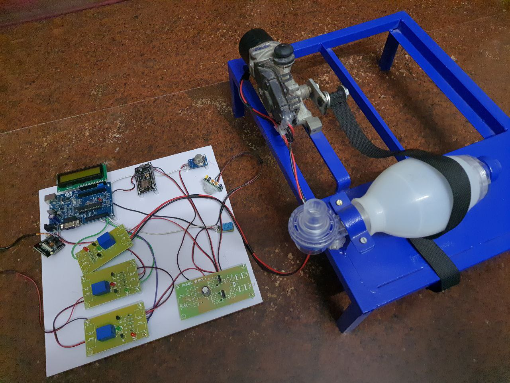
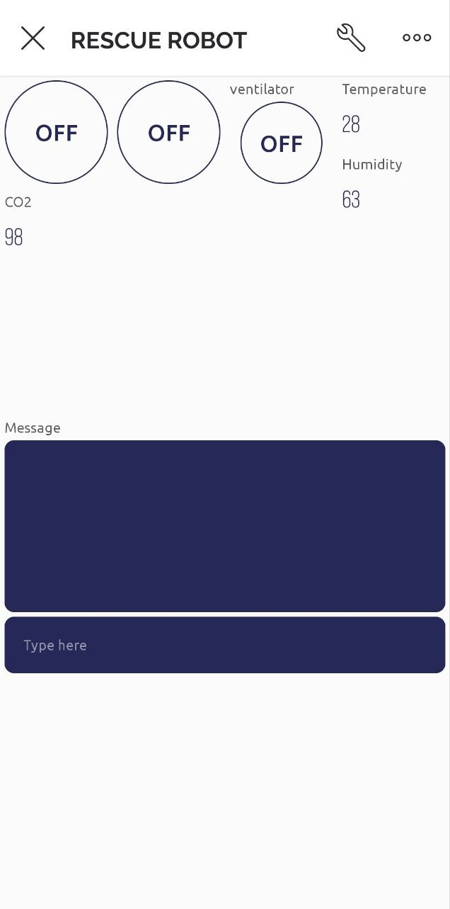

# 🚑 Arduino Based Child Rescue System from Open Borewell

An **IoT-based rescue robot** designed to assist in rescuing children trapped in **open borewells**, a serious issue in rural regions.
The system monitors environmental conditions and remotely controls a **ventilator and rescue mechanism** using a mobile application.

The system uses **Arduino + ESP8266 + Blynk IoT platform** to enable real-time monitoring and control.

---

# 📸 Project Overview

## Hardware Setup



## Mobile Monitoring Dashboard


---

# 🎯 Problem Statement

Open borewells pose a **major safety hazard**. Every year several children fall into borewells where:

* Oxygen levels drop quickly
* Rescue becomes extremely difficult
* Communication with the victim is impossible

This system aims to provide:

* Real-time **environment monitoring**
* **Remote ventilation control**
* **Human detection**
* **Rescue mechanism control**

---

# 🧠 System Features

✔ Remote control through **Blynk IoT mobile app**  
✔ **CO₂ monitoring**  
✔ **Temperature monitoring**  
✔ **Humidity monitoring**  
✔ **Human detection sensor**  
✔ **Ventilator control**  
✔ **Relay-based motor control**  
✔ **Live status messages**

---

# 🏗 System Architecture

```
Sensors → Arduino Controller → ESP8266 WiFi Module → Blynk Cloud → Mobile App
                                      ↓
                                Rescue Robot
                                      ↓
                           Motor + Ventilation System
```

---

# ⚙ Hardware Components

| Component              | Purpose                        |
| ---------------------- | ------------------------------ |
| Arduino Uno            | Main microcontroller           |
| ESP8266 WiFi Module    | Internet connectivity          |
| CO₂ Sensor             | Detect oxygen/CO₂ levels       |
| Temperature Sensor     | Environmental monitoring       |
| Humidity Sensor        | Environmental monitoring       |
| Human Detection Sensor | Detect trapped person          |
| Relay Module           | Motor & ventilator control     |
| DC Motor               | Rescue arm / lifting mechanism |
| Ventilator Pump        | Provide oxygen supply          |
| LCD Display            | Local data monitoring          |
| Power Supply Module    | System power                   |

---

# 📱 Mobile Application (Blynk)

The mobile application provides:

* Robot movement control
* Ventilator control
* Environmental monitoring

### Dashboard Controls

| Button     | Function              |
| ---------- | --------------------- |
| Button 1   | Robot movement        |
| Button 2   | Arm control           |
| Button 3   | Rescue mechanism      |
| Ventilator | Oxygen supply control |
| Terminal   | Status messages       |

---

# 🔌 Pin Configuration

| Pin | Function          |
| --- | ----------------- |
| D1  | Relay 1           |
| D2  | Relay 2           |
| V0  | Control Command 1 |
| V1  | Control Command 2 |
| V2  | Control Command 3 |
| V3  | Temperature       |
| V4  | Humidity          |
| V5  | CO₂ Level         |
| V6  | Terminal Messages |
| V7  | Relay Control 1   |
| V8  | Relay Control 2   |
| V9  | Stop Motor        |

---

# 💻 Arduino Code

The code connects the **ESP8266 to Blynk Cloud** and enables remote control and monitoring.

### Key Features in Code

* WiFi connection using ESP8266
* Blynk IoT integration
* Serial communication with sensors
* Relay control
* Real-time sensor data transmission

Code available in:

```
/code/rescue_robot.ino
```

---

# 🔄 Data Flow

```
Sensor Data
     ↓
Arduino Controller
     ↓
ESP8266 WiFi Module
     ↓
Blynk Cloud Server
     ↓
Mobile Application
```

---

# 🧪 Working Principle

1. Sensors continuously monitor **CO₂, temperature, and humidity**.
2. Data is transmitted to the **Blynk cloud server**.
3. The mobile application displays the values.
4. If **human presence is detected**, a notification is sent.
5. Rescue operators can control:

   * Robot movement
   * Ventilation system
   * Rescue arm mechanism

---

# 🚀 How to Run the Project

### 1️⃣ Install Arduino IDE

Download Arduino IDE:

https://www.arduino.cc/en/software

---

### 2️⃣ Install ESP8266 Board Package

In Arduino IDE:

```
File → Preferences
```

Add:

```
http://arduino.esp8266.com/stable/package_esp8266com_index.json
```

Then install **ESP8266 Boards Manager**.

---

### 3️⃣ Install Required Libraries

Install:

* Blynk
* ESP8266WiFi

From:

```
Sketch → Include Library → Manage Libraries
```

---

### 4️⃣ Configure WiFi and Blynk

Edit the following in the code:

```
char ssid[] = "YOUR_WIFI";
char pass[] = "YOUR_PASSWORD";
char auth[] = "YOUR_BLYNK_TOKEN";
```

---

### 5️⃣ Upload Code

1. Connect ESP8266 to Arduino
2. Select correct board
3. Upload code

---

# 🛠 Future Improvements

* AI-based **human detection**
* GPS location tracking
* Autonomous robotic arm
* Real-time cloud analytics

---

# 🌍 Impact

This system can significantly improve rescue operations and potentially **save lives** in borewell accidents.

---